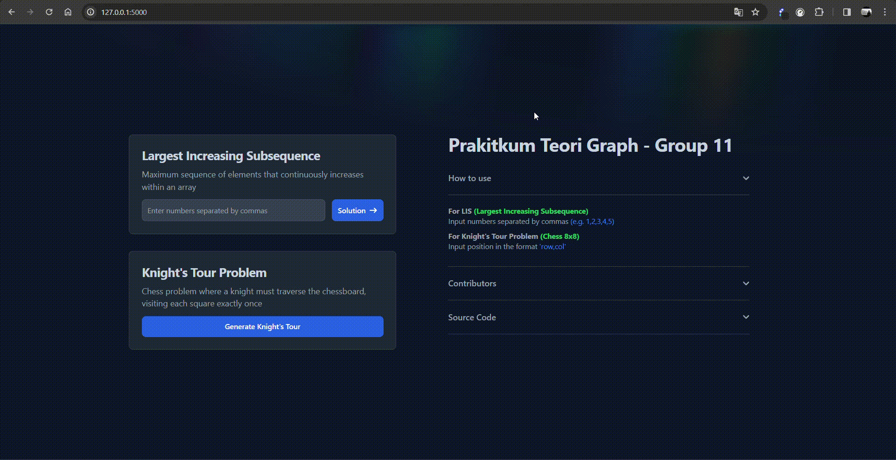
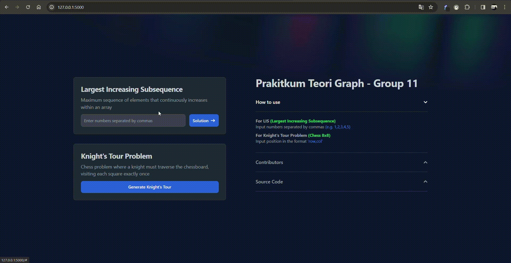

# Praktikum Teori Graf - Group 11

## Group Member

| NRP | Name | Github Account |
| --- | --- | --- |
| 5025211015 | Muhammad Daffa Ashdaqfillah | [daf2a](https://github.com/daf2a) |  
| 5025211021 | Daud Dhiya Rozaan |  [daudhiyaa](https://github.com/daudhiyaa) |
| 5025211109 | Dewangga Dika Darmawan |[ddedida](https://github.com/ddedida) |

## How to run
- Install requirements
  ```bash
  pip install -r requirements.txt
  ```
- Run the program
  ```bash
  python app.py
  ```

## Screenshot

### Main Menu
  </br>

### Largest Increasing Subsequence
  </br>

### Knigth's Open Tour 
  from last visited node, knight not go back to the starting node</br>
  </br>

### Knight's Close Tour
  from last visited node, knight can go back to the starting node</br>
  </br>